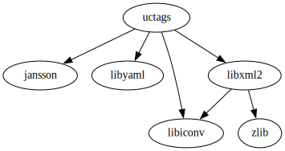

# ctags-nightly-build

build [Universal Ctags](https://github.com/universal-ctags/ctags) every night via GitHub Actions.

## Notes

This repository only provides snapshot prebuilt binaries for `macOS`, `Linux`, `FreeBSD`, `OpenBSD`, `NetBSD`, they're not regular releases.

If you need prebuilt binaries for `Windows`, please go to [ctags-win32](https://github.com/universal-ctags/ctags-win32)

If you encounter any problems with these prebuilt binaries, please file an issue on [Universal Ctags issue tracker](https://github.com/universal-ctags/ctags/issues)

If you are extreamly concerned about performance, building it on you local machine from [source](https://github.com/universal-ctags/ctags) is a better choice as long as you know [Autotools](https://www.gnu.org/software/automake/manual/html_node/Autotools-Introduction.html) well.

## Dependency Graph



## for `Linux`, `FreeBSD`, `OpenBSD`, `NetBSD`

All dependent libraries including libc are statically linked into the executable.

## for `macOS`

All dependent libraries except `/usr/lib/libSystem.B.dylib` are statically linked into the executable.

## builder

These files are created by [ppkg](https://github.com/leleliu008/ppkg)

Some extra files are shipped with the tarball files, which all are located in a hidden directory named `.ppkg`.

Tarball file structure:

```text
uctags-2024.04.04-linux-x86_64
├── .ppkg
│   ├── dependencies
│   │   ├── libiconv.yml
│   │   ├── libjansson.yml
│   │   ├── libxml2.yml
│   │   ├── libyaml.yml
│   │   └── libz.yml
│   ├── COPYING
│   ├── MANIFEST.txt
│   ├── NEWS.rst
│   ├── README.md
│   ├── RECEIPT.yml
│   ├── config.log
│   ├── dependencies.box
│   ├── dependencies.d2
│   ├── dependencies.dot
│   └── dependencies.svg
├── bin
│   ├── ctags
│   ├── optscript
│   └── readtags
└── man
    ├── man1
    │   ├── ctags.1
    │   └── readtags.1
    ├── man5
    │   ├── ctags-json-output.5
    │   └── tags.5
    └── man7
        ├── ctags-client-tools.7
        ├── ctags-faq.7
        ├── ctags-incompatibilities.7
        ├── ctags-lang-asm.7
        ├── ctags-lang-autoit.7
        ├── ctags-lang-automake.7
        ├── ctags-lang-c++.7
        ├── ctags-lang-c.7
        ├── ctags-lang-cuda.7
        ├── ctags-lang-elm.7
        ├── ctags-lang-fortran.7
        ├── ctags-lang-gdscript.7
        ├── ctags-lang-i18nrubygem.7
        ├── ctags-lang-iPythonCell.7
        ├── ctags-lang-inko.7
        ├── ctags-lang-javascript.7
        ├── ctags-lang-julia.7
        ├── ctags-lang-kconfig.7
        ├── ctags-lang-ldscript.7
        ├── ctags-lang-lex.7
        ├── ctags-lang-markdown.7
        ├── ctags-lang-python.7
        ├── ctags-lang-r.7
        ├── ctags-lang-rmarkdown.7
        ├── ctags-lang-sql.7
        ├── ctags-lang-systemtap.7
        ├── ctags-lang-tcl.7
        ├── ctags-lang-terraform.7
        ├── ctags-lang-verilog.7
        ├── ctags-lang-vim.7
        └── ctags-optlib.7
```
